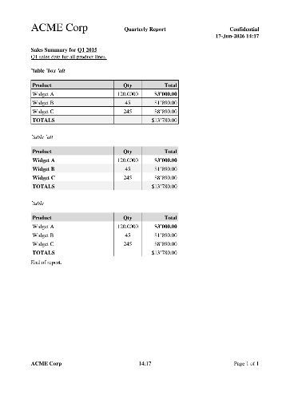

# report-generator.red

A Red module that generates multi-page A4 PDF reports with mixed text and tables.



## How it works

The module generates PostScript, converts it to PDF via `ps2pdf` (Ghostscript), and optionally opens the PDF in the default viewer via `browse`. All rendering happens in PostScript — no external PDF libraries needed.

**Dependencies:** Red, Ghostscript (`ps2pdf`)

### Installing Ghostscript

`ps2pdf` is part of [Ghostscript](https://ghostscript.com/) and is **not** pre-installed on macOS or Windows.

| OS | Install command |
|----|----------------|
| Linux | `sudo apt install ghostscript` |
| macOS | `brew install ghostscript` |
| Windows | Download from [ghostscript.com](https://ghostscript.com/releases/gsdnld.html) or `winget install GhostScript.GhostScript` |

## Usage

```red
do %report-generator.red
```

### Exported function

```red
generate-report header content footer %report.pdf
generate-report/browser header content footer %report.pdf   ; generate and open in default PDF viewer
```

| Argument | Type | Description |
|----------|------|-------------|
| `header` | `block!` or `none!` | Lines shown at the top of every page. Supports style tags and `%DATE%`/`%TIME%`/`%DATETIME%`/`%PAGE%`/`%PAGES%` tokens. |
| `content` | `block!` | Mixed content: blocks for text lines, `'table` blocks for tables |
| `footer` | `block!` or `none!` | Lines shown at the bottom of every page. Same format and token support as header. |
| `output` | `file!` | Output PDF file path |

## Content block

The `content` block is a list of items:

- **Block** — a content line. Each line is a block of values with optional style tags.
- **`"^L"` string** — forces a page break (legacy; also works as `["^L"]` block).
- **Table block** — a nested block starting with `'table`, followed by optional modifiers, column definitions, and row data.

```red
content: copy []
append content ['b "Bold heading" /b]
append content ["Regular text"]
append content [""]
append/only content reduce [
    'table 'box 'alt
    ['< 200 "Name" '> 100 "Amount"]
    ["Widget" 25.00]
    ["Gadget" 42.00]
]
append content ["Text after table"]
```

## Style tags

Styles use lit-word tags (`'b`) to turn on and refinement tags (`/b`) to turn off. Styles stack and auto-close at the end of each line block.

| Tag | End tag | Style |
|-----|---------|-------|
| `'b` | `/b` | **Bold** |
| `'i` | `/i` | *Italic* |
| `'u` | `/u` | Underline |
| `'m` | `/m` | Monospace (Courier) |
| `'h1` | `/h1` | Heading 1 (24pt) |
| `'h2` | `/h2` | Heading 2 (18pt) |
| `'h3` | `/h3` | Heading 3 (14pt) |

Line-level modifiers (`'m`, `'h1`, `'h2`, `'h3`) can only appear at the start of a content line block and apply to the entire line.

End tags are optional — unclosed styles auto-close at the end of each line.

### Examples

```red
['b "Bold text" /b " normal text"]
['b 'i "Bold italic" /i /b]
['m "Monospace line"]
['h1 "Big heading" /h1 " continues normal"]
['b "Starts bold " /b 'i "then italic" /i]
```

Works in headers, footers, content lines, and table cells.

## Column definitions

Table columns are defined by a block of values after `'table` (and optional modifiers):

```
['< 'b 180 "Product" '^ 60 5.4 "Qty" '> 80 'money "Total"]
```

| Modifier | Meaning |
|----------|---------|
| `'<` | Left-align next column |
| `'^` | Center next column |
| `'>` | Right-align next column |
| `'b` | Bold data cells in next column (header is always bold) |
| `'money` | Format numbers as money with thousands separator |
| `5.4` | Format numbers with 4 decimal places |
| `180` | Set column width in points |

Modifiers before each column title string apply to that column.

## Table modifiers

| Modifier | Meaning |
|----------|---------|
| `'box` | Draw outer border around table |
| `'alt` | Alternate row background (light gray on even rows) |

Both can be combined: `'table 'box 'alt`. Without modifiers, the table has no outer border and no alternating rows. Column separators are always drawn. Header rows always have a gray background.

### Table examples

```red
; Boxed table with alternating rows and number formatting
[
    'table 'box 'alt
    ['< 180 "Product" '^ 60 5.4 "Qty" '> 80 'money "Total"]
    ["Widget A" 120 3000]
    ["Widget B" "45" 1890.0]
    ['b "TOTALS" /b "" 13780.00]
]

; Plain table (no box, no alternation)
[
    'table
    ['< 200 "Name" '> 100 "Amount"]
    ["Item A" 100.00]
]
```

### Page breaks in tables

Use a row where the first column is `"^L"` to break a table across pages. The table header is automatically repeated on the next page:

```red
["^L" "" ""]
```

## Number and money formatting

Numbers in table cells are formatted automatically based on the column definition:

- **`'money`** — formats as `$1'234.50` with thousands separator and 2 decimal places
- **`5.4`** — formats with 4 decimal places
- **No format** — numbers displayed as-is

Numbers can be Red integers, floats, or words that evaluate to numbers.

## Header and footer tokens

| Token | Replaced with | Example output |
|-------|---------------|----------------|
| `%PAGE%` | Current page number | `3` |
| `%PAGES%` | Total number of pages | `12` |
| `%DATE%` | Current date | `2026-06-13` |
| `%TIME%` | Current time (hh:mm) | `19:04` |
| `%DATETIME%` | Date and time combined | `2026-06-13 19:04` |

## Page layout

- A4 (595 x 842 pts)
- 50pt margins on all sides
- Font: Times-Roman 12pt, line height 15pt. Available styles: Times-Bold, Times-Italic, Times-BoldItalic. Mono: Courier family (`'m` tag).
- Table rows: 19pt (line-height + 4)
- Table headers: always bold with gray background
- Column separators: thin 0.5pt lines

## Examples

### Simple example

See [`simple-example.red`](simple-example.red) — run with `red simple-example.red`:

```red
Red []

do %report-generator.red

widgetC: ["Widget C" "245" 8890.00]
threethousand: 3000

generate-report 
    [
        ['h1 "ACME Corp" /h1 'b "Quarterly Report" /b "Confidential"]
        [" " " " 'b "%DATETIME%"]
    ]
    [
        ['b "Sales Summary for " /b 'u "Q1 2015" /u]
        ["Q1 sales data for all product lines."]
        [
            'table 'box 'alt
            ['< 180 "Product" '^ 60 5.4 "Qty" '> 80 'money "Total"]
            ["Widget A" 120 'b threethousand]
            ["Widget B" "45" 1890.0]
            widgetC
            ['b "TOTALS" /b "" "$13'780.00"]
        ]
        ["End of report."]
    ]
    [
        ['b "ACME Corp" /b "%TIME%" "Page %PAGE% of %PAGES%"]
    ]
    %reports/simple-example.pdf
```

### Full example

See [`full-example.red`](full-example.red) — run with `red full-example.red`. Generates a multi-page PDF demonstrating all features: text styles, headings, monospace, boxed/plain/alternating tables, number formatting, center-aligned columns, styled table cells, dynamic content, and table page breaks.

### GUI test harness

See [`report-generator-test.red`](report-generator-test.red) — a GUI with buttons to generate individual demo PDFs. Run with `red report-generator-test.red`. Includes a Preview checkbox to open PDFs in the default viewer.

## File overview

| File | Purpose |
|------|---------|
| `report-generator.red` | The module. Load with `do %report-generator.red` |
| `simple-example.red` | Simple example — run with `red simple-example.red` |
| `full-example.red` | Full example with all features — run with `red full-example.red` |
| `report-generator-test.red` | GUI test harness with individual demo buttons |
| `reports/` | Output directory for generated PDFs (gitignored) |

## Architecture

The module is wrapped in a `context` to isolate all internal state. Only `generate-report` is exported (via `set`).

**Internal helpers:**

| Function | Purpose |
|----------|---------|
| `ps-escape` | Escapes `\`, `(`, `)` in PostScript strings |
| `emit-font` | Emits a PostScript font selection command |
| `emit-text` | Emits a left/center/right-aligned text drawing command |
| `emit-text-join` | Emits left-aligned text using PS `currentpoint` chaining |
| `emit-text-start` | Initializes PS variables for a joined line |
| `emit-underline` | Draws an underline beneath text |
| `emit-styled-text` | Selects font, emits aligned text with styles |
| `emit-rect` | Emits a stroked rectangle |
| `emit-filled-rect` | Emits a filled rectangle with gray fill |
| `emit-vline` | Emits a thin vertical line (column separator) |
| `emit-header-v2` | Emits header lines with L/C/R positioning and styles |
| `emit-footer-v2` | Emits footer lines with token replacement and styles |
| `emit-content-line` | Processes a content line block |
| `emit-table-header-v2` | Emits a table header row with gray background |
| `emit-table-row-v2` | Emits a table data row with style and format support |
| `process-line-values` | Parses style tags into `[styles text ...]` pairs |
| `parse-columns-v2` | Parses column definitions |
| `format-number-value` | Formats numbers as money or with decimal places |
| `format-decimal` | Formats numbers with thousands separators |
| `end-tag-target` | Maps refinement end-tags to style words |

**Rendering pipeline:**

1. Content is processed page by page, tracking `page-y` position
2. Each page's PostScript is collected into a `pages` block
3. Tokens are replaced per page, footers are emitted
4. Final PS is assembled with DSC comments, converted to PDF
