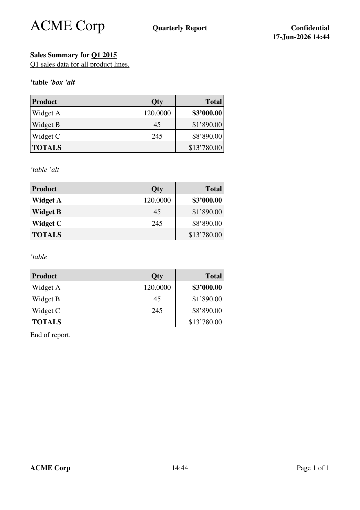

# report-generator.red

A Red module that generates multi-page A4 PDF reports with mixed text and tables.



## How it works

The module generates PostScript, converts it to PDF via `ps2pdf` (Ghostscript), and optionally opens the PDF in the default viewer via `browse`. All rendering happens in PostScript — no external PDF libraries needed.

**Dependencies:** Red, Ghostscript (`ps2pdf`)

### Installing Ghostscript

`ps2pdf` is part of [Ghostscript](https://ghostscript.com/) and is **not** pre-installed on macOS or Windows.

| OS | Install command |
|----|----------------|
| Linux | `sudo apt install ghostscript` |
| macOS | `brew install ghostscript` |
| Windows | Download from [ghostscript.com](https://ghostscript.com/releases/gsdnld.html) or `winget install GhostScript.GhostScript` |

## Usage

```red
do %report-generator.red
```

### Exported function

```red
generate-report header content footer %report.pdf
generate-report/browser header content footer %report.pdf   ; generate and open in default PDF viewer
```

| Argument | Type | Description |
|----------|------|-------------|
| `header` | `block!` or `none!` | Lines shown at the top of every page. Supports style blocks and `%DATE%`/`%TIME%`/`%DATETIME%`/`%PAGE%`/`%PAGES%` tokens. |
| `content` | `block!` | Mixed content: blocks for text lines, `'table` blocks for tables |
| `footer` | `block!` or `none!` | Lines shown at the bottom of every page. Same format and token support as header. |
| `output` | `file!` | Output PDF file path |

## DSL convention: data-then-style-block

The DSL uses a consistent **"data then style block"** pattern. Everything that is not a block is data to be displayed. A block that follows a data element contains style attributes that apply to that preceding element.

```red
["Hello" ['b]]                ; "Hello" in bold
["Hello" ['b 'i]]             ; "Hello" in bold italic
["Hello" ['b 'u 'm]]          ; "Hello" in bold, underlined, monospace
["Hello" ['h1]]               ; "Hello" as heading 1
["Hello" []]                  ; "Hello" unstyled (empty block)
["Hello"]                     ; "Hello" unstyled (no style block)
```

Multiple data+style pairs can appear in a single line for mixed formatting:

```red
["Sales Summary" ['b] " for " "Q1 2015" ['u]]
;   ^bold            ^regular    ^underlined
```

Style blocks are optional. Omitting the style block (or using `[]`) means no styling is applied.

## Content block

The `content` block is a list of items:

- **Block** — a content line. Each line is a block of data elements with optional trailing style blocks.
- **`"^L"` string** — forces a page break (legacy; also works as `["^L"]` block).
- **Table block** — a nested block starting with `'table`, followed by optional modifiers, column definitions, and row data.

```red
content: copy []
append content ["Bold heading" ['b]]
append content ["Regular text"]
append content [""]
append/only content reduce [
    'table 'box 'alt
    ["Name" ['< 200] "Amount" ['> 100]]
    ["Widget" 25.00]
    ["Gadget" 42.00]
]
append content ["Text after table"]
```

## Style attributes

Style attributes are placed in a block after the data element they modify. They use words (not lit-words with `/` end-tags).

| Attribute | Style |
|-----------|-------|
| `b` | **Bold** |
| `i` | *Italic* |
| `u` | Underline |
| `m` | Monospace (Courier) |
| `h1` | Heading 1 (24pt bold) |
| `h2` | Heading 2 (18pt bold) |
| `h3` | Heading 3 (14pt bold) |

Attributes can be combined in a single block: `['b 'i 'u]` for bold italic underlined.

Headings default to bold font. All style attributes — including `'m`, `'h1`, `'h2`, `'h3` — can be applied per-segment. When a line has mixed font sizes, the line height adapts to the tallest segment. In tables, row heights similarly adapt to the largest font in the row.

```red
["Big " ['h1] "and small" [] " and " ['h3] "tiny" [] " on one line."]
```

### Examples

```red
["Bold text" ['b]]
["Bold italic" ['b 'i]]
["Monospace line" ['m]]
["Big heading" ['h1]]
["Regular" ['b] " then italic" ['i]]
["Big " ['h1] "and small" [] " on one line"]
["Regular " [] "mono " ['m] "and " [] "bold" ['b] " mixed"]
```

Works in headers, footers, content lines, and table cells.

## Column definitions

Table columns are defined by a block of data+style pairs after `'table` (and optional modifiers). Each column title is followed by a style block specifying alignment, width, and format:

```
["Product" ['< 180] "Qty" ['^ 60 5.4] "Total" ['> 80 'money]]
```

| Modifier | Meaning |
|----------|---------|
| `'<` | Left-align next column |
| `'^` | Center next column |
| `'>` | Right-align next column |
| `'b` | Bold data cells in next column (header is always bold) |
| `'money` | Format numbers as money with thousands separator |
| `5.4` | Format numbers with 4 decimal places |
| `180` | Set column width in points (default: 80) |

Column style blocks can be omitted — alignment defaults to left, width defaults to 80.

## Table modifiers

| Modifier | Meaning |
|----------|---------|
| `'box` | Draw outer border around table |
| `'alt` | Alternate row background (light gray on even rows) |

Both can be combined: `'table 'box 'alt`. Without modifiers, the table has no outer border and no alternating rows. Column separators are always drawn. Header rows always have a gray background.

### Table examples

```red
; Boxed table with alternating rows and number formatting
[
    'table 'box 'alt
    ["Product" ['< 180] "Qty" ['^ 60 5.4] "Total" ['> 80 'money]]
    ["Widget A" 120 3000]
    ["Widget B" "45" 1890.0]
    ["TOTALS" ['b] "" 13780.00]
]

; Plain table (no box, no alternation)
[
    'table
    ["Name" ['< 200] "Amount" ['> 100]]
    ["Item A" 100.00]
]

; Columns with defaults (left-aligned, 80pt wide)
[
    'table
    ["Name" [] "Amount" []]
    ["Item A" 100.00]
]
```

### Styled table cells

Style blocks work inside table rows, applying to the preceding cell:

```red
["Widget A" ['i] "Active" ['b 'u] 250.00]
;  ^regular    ^italic  ^bold+underline ^regular
```

### Page breaks in tables

Use a row where the first column is `"^L"` to break a table across pages. The table header is automatically repeated on the next page:

```red
["^L" "" ""]
```

## Number and money formatting

Numbers in table cells are formatted automatically based on the column definition:

- **`'money`** — formats as `$1'234.50` with thousands separator and 2 decimal places
- **`5.4`** — formats with 4 decimal places
- **No format** — numbers displayed as-is

Numbers can be Red integers, floats, or words that evaluate to numbers.

## Header and footer tokens

| Token | Replaced with | Example output |
|-------|---------------|----------------|
| `%PAGE%` | Current page number | `3` |
| `%PAGES%` | Total number of pages | `12` |
| `%DATE%` | Current date | `2026-06-19` |
| `%TIME%` | Current time (hh:mm) | `19:04` |
| `%DATETIME%` | Date and time combined | `2026-06-19 19:04` |

Header and footer lines support positional alignment: 1st segment is left-aligned, 2nd is centered, 3rd is right-aligned.

## Page layout

- A4 (595 x 842 pts)
- 50pt margins on all sides
- Font: Times-Roman 12pt, line height 15pt. Available styles: Times-Bold, Times-Italic, Times-BoldItalic. Mono: Courier family (`'m` tag).
- Line and row heights adapt to the largest font size in the line/row (e.g. `'h1` segments make the line taller)
- Table headers: always bold 12pt with gray background, fixed 19pt height
- Table data rows: height adapts to largest segment font size
- Column separators: thin 0.5pt lines

## Examples

### Simple example

See [`example-simple.red`](example-simple.red) — run with `red example-simple.red`:

```red
Red []

do %report-generator.red

widgetC: ["Widget C" "245" ['b] 8890.00]
threethousand: 3000

generate-report 
    [ ;HEADER
        ["ACME Corp" [h1] "Quarterly Report" ['b] "Confidential"]
        [" " " " "%DATETIME%" ['b]]
    ] ;header
    [ ;CONTENT
        ["Sales Summary for " ['b] "Q1 2015" ['u]]
        ["Q1 sales data for all product lines." ['u]]
        [
            'table 'box 'alt
            ["Product" ['< 180] "Qty" ['^ 60 5.4] "Total" ['> 80 'money]]
            ["Widget A" 120 threethousand ['b]]
            ["Widget B" "45" 1890.0]
            widgetC
            ["TOTALS" ['b] "" "$13'780.00"]
        ]
        ["End of report."]
    ] ;content
    [ ;FOOTER
        ["ACME Corp" ['b] "%TIME%" "Page %PAGE% of %PAGES%"]
    ] ;footer
    %reports/example-simple.pdf
```

### Full example

See [`example-full.red`](example-full.red) — run with `red example-full.red`. Generates a multi-page PDF demonstrating all features: text styles, headings, monospace, boxed/plain/alternating tables, number formatting, center-aligned columns, styled table cells, dynamic content, and table page breaks.

### GUI test harness

See [`report-generator-test.red`](report-generator-test.red) — a GUI with buttons to generate individual demo PDFs. Run with `red-view report-generator-test.red`. Includes a Preview checkbox to open PDFs in the default viewer.

## File overview

| File | Purpose |
|------|---------|
| `report-generator.red` | The module. Load with `do %report-generator.red` |
| `example-simple.red` | Simple example — run with `red example-simple.red` |
| `example-full.red` | Full example with all features — run with `red example-full.red` |
| `report-generator-test.red` | GUI test harness with individual demo buttons |
| `reports/` | Output directory for generated PDFs (gitignored) |

## Architecture

The module is wrapped in a `context` to isolate all internal state. Only `generate-report` is exported (via `set`).

**Internal helpers:**

| Function | Purpose |
|----------|---------|
| `ps-escape` | Escapes `\`, `(`, `)` in PostScript strings |
| `emit-font` | Emits a PostScript font selection command |
| `emit-text` | Emits a left/center/right-aligned text drawing command |
| `emit-text-join` | Emits left-aligned text using PS `currentpoint` chaining |
| `emit-text-start` | Initializes PS variables for a joined line |
| `emit-underline` | Draws an underline beneath text |
| `emit-styled-text` | Selects font, emits aligned text with styles |
| `emit-segmented-line` | Emits a parsed line with positional L/C/R alignment |
| `emit-rect` | Emits a stroked rectangle |
| `emit-filled-rect` | Emits a filled rectangle with gray fill |
| `emit-vline` | Emits a thin vertical line (column separator) |
| `emit-header-v3` | Emits header lines with L/C/R positioning and styles |
| `emit-footer-v3` | Emits footer lines with token replacement and styles |
| `emit-content-line-v3` | Processes a content line block |
| `emit-table-header-v3` | Emits a table header row with gray background |
| `emit-table-row-v3` | Emits a table data row with style and format support |
| `parse-row-segments` | Parses data+style blocks into `[styles text ...]` pairs |
| `parse-columns-v3` | Parses column definitions with data+style blocks |
| `table-modifiers` | Scans a table block for `'box`, `'alt`, and column index |
| `max-style-size` | Returns the largest font size from style blocks in a line/row |
| `line-height-for` | Returns effective line height based on max segment font size |
| `row-height-for` | Returns effective table row height based on max segment font size |
| `format-number-value` | Formats numbers as money or with decimal places |
| `format-decimal` | Formats numbers with thousands separators |

**Rendering pipeline:**

1. Content is processed page by page, tracking `page-y` position
2. Each page's PostScript is collected into a `pages` block
3. Tokens are replaced per page, footers are emitted
4. Final PS is assembled with DSC comments, converted to PDF
