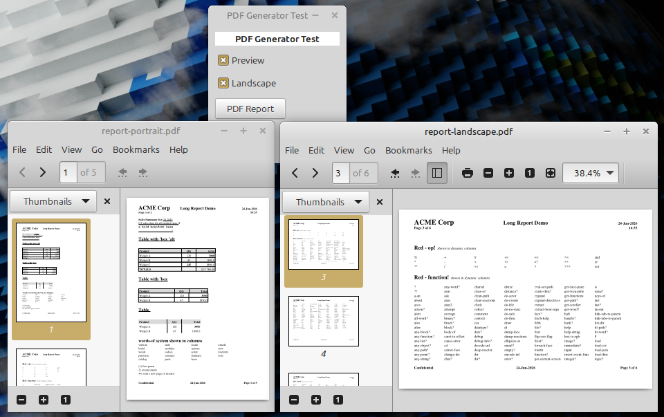

# report-generator.red

A Red module that generates multi-page A4 PDF reports with mixed text and tables.



## How it works

The module generates PostScript, converts it to PDF via `ps2pdf` (Ghostscript), and optionally opens the PDF in the default viewer via `browse`. All rendering happens in PostScript — no external PDF libraries needed.

**Dependencies:** Red, Ghostscript (`ps2pdf`)

### Installing Ghostscript

`ps2pdf` is part of [Ghostscript](https://ghostscript.com/) and is **not** pre-installed on macOS or Windows.

| OS | Install command |
|----|----------------|
| Linux | `sudo apt install ghostscript` |
| macOS | `brew install ghostscript` |
| Windows | Download from [ghostscript.com](https://ghostscript.com/releases/gsdnld.html) or `winget install GhostScript.GhostScript` |

## Usage

```red
do %report-generator.red
```

### Exported functions

```red
generate-report content %report.pdf
generate-report/browser content %report.pdf   ; generate and open in default PDF viewer
paper-format 'a4                              ; set paper size (default: a4)
paper-format/landscape 'a4                    ; set paper size in landscape orientation
```

| Function | Argument | Type | Description |
|----------|----------|------|-------------|
| `generate-report` | `content` | `block!` | Flat block with `'HEADER`, `'CONTENT`, `'FOOTER` sections |
| | `output` | `file!` | Output PDF file path |
| `paper-format` | `name` | `word!` | Paper size: `a4`, `letter`, `legal`, `a3`, `a5` |

## Content structure

The content block is a flat list of items delimited by section markers:

```red
generate-report [
    'HEADER
    header lines...
    'CONTENT
    content lines and tables...
    'FOOTER
    footer lines...
] %report.pdf
```

Each section contains line blocks. Tables are inline — no nesting or `reduce` needed.

### Section markers

| Marker | Purpose |
|--------|---------|
| `'HEADER` | Lines shown at the top of every page |
| `'CONTENT` | Report body: text lines and tables |
| `'FOOTER` | Lines shown at the bottom of every page |

Sections are optional. If `'HEADER` is omitted, no header is rendered. Same for `'FOOTER`.

## Line blocks

Each line is a block. The first element determines the type:

- **Block** (first element is a block) — line-wide style, applies to all unstyled segments
- **`'table`** (first element) — table definition
- **`'column`** (first element) — multi-column layout
- **Otherwise** — data elements followed by optional style blocks

### Data-then-style-block pattern

Data elements are followed by style blocks that apply to the preceding element:

```red
["Hello" ['b]]                ; "Hello" in bold
["Hello" ['b 'i]]             ; "Hello" in bold italic
["Hello" ['h1]]               ; "Hello" as heading 1
["Hello" []]                  ; "Hello" unstyled (empty block)
["Hello"]                     ; "Hello" unstyled (no style block)
```

Multiple data+style pairs on one line:

```red
["Sales Summary" ['b] " for " "Q1 2015" ['u]]
;   ^bold              ^regular    ^underlined
```

### Line-wide styles

When the first element of a line block is a block (not followed by data), it's a line-wide style. Segments without their own style block inherit the line-wide style. Segments with their own style block **merge** with the line-wide style — inherited attributes are preserved:

```red
[['b] "ACME Corp" [h1] "Quarterly Report" [] "Confidential"]
; ^line-wide bold  ^h1 for "ACME Corp"  ^regular (no style)  ^bold (inherited)
```

```red
[['i] "ACME Corp" ['b 'h2] "%TIME%" "Page %PAGE% of %PAGES%"]
; ^line-wide italic  ^bold h2 for "ACME Corp"  ^italic (inherited)  ^italic (inherited)
```

```red
[['m] "Record #" 1 ['b 5.0] ": Value " 42 ['b 6.3]]
; ^line-wide mono  ^mono (inherited)  ^mono bold (merged)  ^mono (inherited)  ^mono bold (merged)
```

## Style attributes

| Attribute | Style |
|-----------|-------|
| `b` | **Bold** |
| `i` | *Italic* |
| `u` | Underline |
| `m` | Monospace (Courier) |
| `h1` | Heading 1 (24pt bold) |
| `h2` | Heading 2 (18pt bold) |
| `h3` | Heading 3 (14pt bold) |

Attributes can be combined: `['b 'i 'u]` for bold italic underlined.

Headings default to bold font. All style attributes — including `'m`, `'h1`, `'h2`, `'h3` — can be applied per-segment. Line and row heights adapt to the tallest segment.

```red
["Big " ['h1] "and small" [] " and " ['h3] "tiny" [] " on one line."]
```

## Tables

Tables start with `'table` followed by optional modifiers, then a column definition block, then row blocks:

```red
['table 'box 'alt
    ["Product" ['< 180] "Qty" ['^ 60 5.4] "Total" ['> 80 'money]]
    ["Widget A" 120 3000]
    ["Widget B" "45" 1890.0]
    ["TOTALS" ['b] "" 13780.00]
]
```

### Table modifiers

| Modifier | Meaning |
|----------|---------|
| `'box` | Draw outer border around table |
| `'alt` | Alternate row background (light gray on even rows) |

Both can be combined: `'table 'box 'alt`. Column separators are always drawn. Header rows always have a gray background.

### Column definitions

Each column title is followed by a style block specifying alignment, width, and format:

```red
["Product" ['< 180] "Qty" ['^ 60 5.4] "Total" ['> 80 'money]]
```

| Modifier | Meaning |
|----------|---------|
| `'<` | Left-align column |
| `'^` | Center column |
| `'>` | Right-align column |
| `'b` | Bold data cells in column (header itself is always bold) |
| `'blank` | Suppress zero values — show empty cell instead of `0` |
| `'money` | Format numbers as money with thousands separator |
| `5.4` | Format numbers with 4 decimal places |
| `180` | Set column width in points (default: 80) |

### Styled table cells

Style blocks work inside table rows:

```red
["Widget A" ['i] "Active" ['b 'u] 250.00]
```

### Page breaks in tables

Use a row where the first column is `"^L"` to break a table across pages. The table header is automatically repeated:

```red
["^L" "" ""]
```

## Number and money formatting

Numbers in table cells are formatted automatically based on the column definition:

- **`'money`** — formats as `$1'234.50` with thousands separator and 2 decimal places
- **`5.4`** — formats with 4 decimal places
- **No format** — numbers displayed as-is

### Float formatting in style blocks

A float in a style block formats the preceding number. The integer part specifies the minimum field width (padded with leading spaces), and the decimal part specifies the number of decimal places:

```red
["Amount: " 42.5678 ['b 2.0]]    ; → "42" (bold, 0 decimals, min width 2)
["Value: " 42 ['m 6.3]]          ; → "   42.000" (mono, 3 decimals, min width 6)
["Pi: " 3.14159 ['m 5.4]]        ; → "3.1415" (mono, 4 decimals, min width 5)
```

Works in content lines and table cells. If the preceding data is not a number, the float is ignored.

## Columns layout

Multi-column layout for short lines, like newspaper columns. Rows are distributed evenly across columns, filling left-to-right:

```red
['column 200 20
    [['m] "Record #" 1 ['b 5.0]]
    [['m] "Record #" 2 ['b 5.0]]
    ...
]
```

| Parameter | Meaning |
|-----------|---------|
| `'column` | Starts a column layout block |
| `200` | Column width in points |
| `20` | Gap between columns in points |

The module calculates how many columns fit in the available page width, then distributes rows evenly across them. Page breaks are handled automatically — when rows overflow, they continue on the next page with the same column layout. When remaining rows fit on the current page, they are split evenly across all columns so content below can continue normally.

## Conditional page breaks

`["^L" N]` breaks to a new page only if fewer than N lines remain:

```red
["^L" 15]     ; break only if < 15 lines of space left
"^L"          ; unconditional break (string, not block)
```

Useful for keeping sections together without forcing unnecessary breaks.

## Header and footer tokens

| Token | Replaced with | Example output |
|-------|---------------|----------------|
| `%PAGE%` | Current page number | `3` |
| `%PAGES%` | Total number of pages | `12` |
| `%DATE%` | Current date | `2026-06-20` |
| `%TIME%` | Current time (hh:mm) | `19:04` |
| `%DATETIME%` | Date and time combined | `2026-06-20 19:04` |

Header and footer lines support positional alignment: 1st segment is left-aligned, 2nd is centered, 3rd is right-aligned.

## Page layout

- Default: A4 (595 x 842 pts). Use `paper-format` to change: `a4`, `letter`, `legal`, `a3`, `a5`. Add `/landscape` for horizontal orientation.
- 50pt margins on all sides
- Font: Times-Roman 12pt, line height 15pt. Available styles: Times-Bold, Times-Italic, Times-BoldItalic. Mono: Courier family (`'m` tag).
- Line and row heights adapt to the largest font size in the line/row
- Table headers: always bold 12pt with gray background, fixed 19pt height
- Table data rows: height adapts to largest segment font size
- Column separators: thin 0.5pt lines

## Examples

### Full example

See [`report-generator-test.red`](report-generator-test.red) — a GUI with buttons to generate portrait and landscape demo PDFs. Run with `red-view report-generator-test.red`. Includes Preview and Landscape checkboxes. Demonstrates all features: text styles, headings, monospace, boxed/plain/alternating tables, number formatting, column layout with dynamic content, and mixed font sizes.

## File overview

| File | Purpose |
|------|---------|
| `report-generator.red` | The module. Load with `do %report-generator.red` |
| `report-generator-test.red` | GUI test harness — run with `red-view report-generator-test.red` |
| `functions.txt` | Data file used by the test harness for dynamic column layout |
| `verify.red` | Headless PS output verification script |
| `reports/` | Output directory for generated PDFs (gitignored) |

## Architecture

The module is wrapped in a `context` to isolate all internal state. `generate-report` and `paper-format` are exported (via `set`).

**Internal helpers:**

| Function | Purpose |
|----------|---------|
| `emit` | Appends a PostScript line with newline to output buffer |
| `ps-escape` | Escapes `\`, `(`, `)` in PostScript strings |
| `emit-font` | Emits a PostScript font selection command |
| `emit-text` | Emits a left/center/right-aligned text drawing command |
| `emit-text-join` | Emits left-aligned text using PS `currentpoint` chaining |
| `emit-text-start` | Initializes PS variables for a joined line |
| `emit-underline` | Draws an underline beneath text |
| `emit-styled-text` | Selects font, emits aligned text with styles |
| `emit-rect` | Emits a stroked rectangle (0.5pt lines) |
| `emit-filled-rect` | Emits a filled rectangle with gray fill |
| `emit-vline` | Emits a thin vertical line (column separator) |
| `emit-header` | Emits header lines with L/C/R positioning and styles |
| `emit-footer` | Emits footer lines with token replacement and styles |
| `emit-header-line` | Emits a single header/footer line with line-wide style support |
| `emit-content-line` | Emits a single content line with line-wide style support |
| `emit-table-row` | Emits a table row (header or data) with box alignment |
| `merge-styles` | Merges line-wide styles into segment styles |
| `parse-sections` | Splits flat content into header/content/footer by lit-word markers |
| `parse-line` | Extracts line-wide style block and segments from a line block |
| `parse-row-segments` | Parses data+style blocks into `[styles text ...]` pairs |
| `parse-columns` | Parses column definitions with data+style blocks |
| `table-modifiers` | Scans a table block for `'box`, `'alt`, and column index |
| `max-style-size` | Returns the largest font size from style blocks in a line/row |
| `heading-gap` | Returns extra spacing above a line with heading-sized segments |
| `row-height` | Returns effective table row height based on max segment font size |
| `format-number-value` | Formats numbers as money or with decimal places |
| `format-decimal` | Formats numbers with thousands separators |
| `ceil-div` | Integer division rounding up |
| `is-page-break-row?` | Checks if a table row is a `^L` page break marker |
| `assemble-ps` | Builds the final PostScript document from page buffers |
| `convert-to-pdf` | Calls `ps2pdf` with error handling |

**Rendering pipeline:**

1. `parse-sections` splits flat content into header/content/footer blocks
2. Content is processed page by page, tracking `page-y` position
3. Tables render with per-row height adaptation and seamless box connection
4. Columns render with PS `gsave/translate/grestore` for horizontal layout
5. Each page's PostScript is collected into a `pages` block
6. `assemble-ps` replaces tokens per page, emits footers, wraps in PS DSC comments
7. `convert-to-pdf` writes PS and calls `ps2pdf` to produce the final PDF
